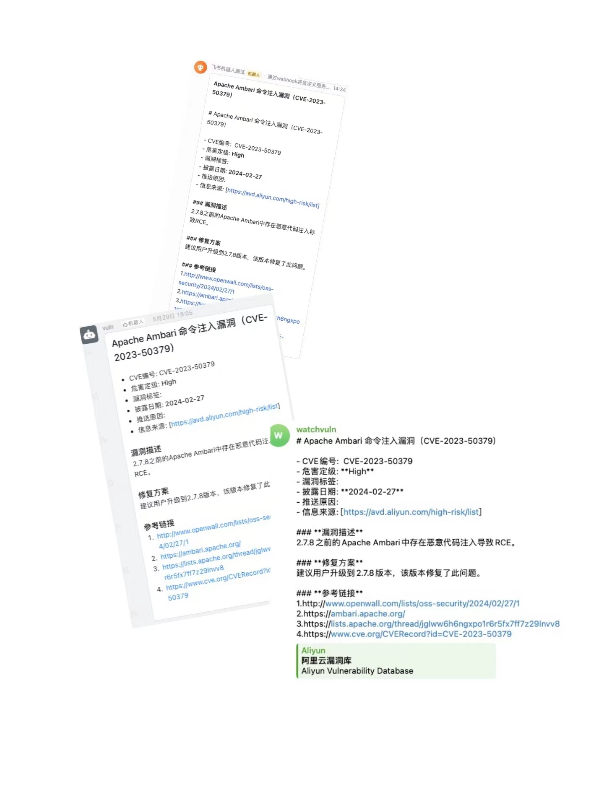

# watchvuln-rs

## 介绍

程序还在持续完善功能

当前抓取了这几个站点的数据:

| 名称                 | 地址                                                           | 推送策略                                                                     |
| -------------------- | -------------------------------------------------------------- | ---------------------------------------------------------------------------- |
| 阿里云漏洞库         | <https://avd.aliyun.com/high-risk/list>                        | 等级为高危或严重                                                             |
| OSCS开源安全情报预警 | <https://www.oscs1024.com/cm>                                  | 等级为高危或严重**并且**包含 `预警` 标签                                     |
| 知道创宇Seebug漏洞库 | <https://www.seebug.org/>                                      | 等级为高危或严重                                                             |
| CISA KEV             | <https://www.cisa.gov/known-exploited-vulnerabilities-catalog> | 全部推送                                                                     |
| 奇安信威胁情报中心   | <https://ti.qianxin.com/>                                      | 等级为高危严重**并且**包含 `奇安信CERT验证` `POC公开` `技术细节公布`标签之一 |

## 开发

已经配置了vscode devcontainer

初始化数据库表：

```bash
sea-orm-cli migrate up
```

本地测试：

```bash
RUST_LOG=info TG_CHAT_ID=xxx TG_TOKEN=xxx cargo run
```

## 支持推送方式

- 钉钉机器人
- Telegram机器人

## 推送效果



参考GO版本的：<https://github.com/zema1/watchvuln>
